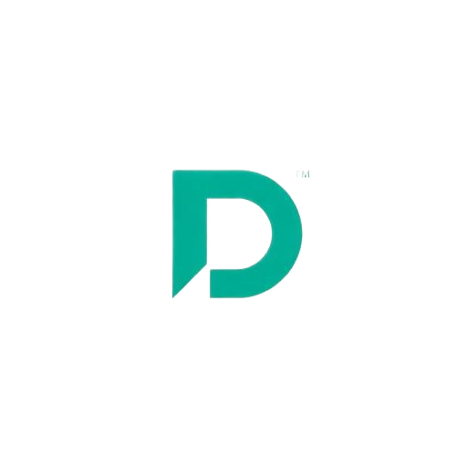
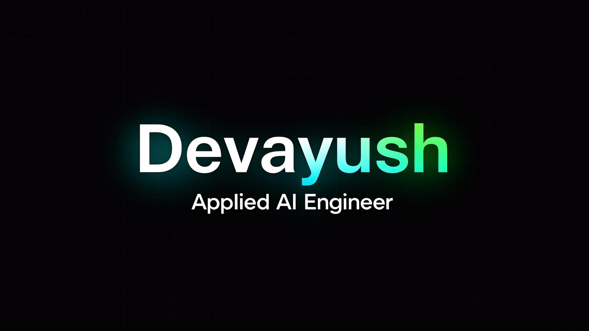

<div align="center">
  
  <h1>Devayush — Applied AI Engineer Portfolio</h1>
  
  *A production-grade portfolio showcasing LLM systems, RAG pipelines, and evaluation frameworks.*  
  Scaffolded with [Lovable](https://lovable.dev) to accelerate boilerplate UI, then rigorously customized and architected from the ground up for maintainability.

  <p align="center">
    <a href="https://devayush-portfolio.vercel.app/"><strong>View Live Site »</strong></a>
  </p>

  <a href="https://devayush-portfolio.vercel.app/">
    
  </a>
</div>

<br />

## 🌟 The Philosophy
This repository serves as a functional resume and portfolio for my work in the applied AI space. Rather than treating this as a simple weekend project, the codebase has been deliberately structured to mirror **production software architecture**—separating concerns, organizing by functional domains, and ensuring high customizability. 

I prioritize systems thinking: understanding how things compose over simply knowing what tools to use.

## 🏗 System Architecture
The application diverges from flat, default AI scaffolding. It aggressively utilizes **Feature-Based Architecture**, ensuring components are grouped strictly by their domain relevance rather than technical type.

```
src/
├── core/
│   └── layout/         # Application shell (Navbar, Footer, NavLink)
├── features/
│   ├── ai-chat/        # Embedded Groq-powered AI Assistant
│   └── home/           # Landing page domains (Projects, TechStack, Hero)
└── components/
    └── shared/         # Reusable primitives (ThemeToggle, ScrollReveal)
```

## 🛠 Tech Stack
- **Framework:** React + Vite
- **TypeScript:** Strict type-safety across the client
- **Styling:** Tailwind CSS + Radix UI (`shadcn/ui`)
- **Animation:** Framer Motion (for specialized hardware-accelerated transitions)
- **Backend Edge:** Supabase Edge Functions (Deno) / Express
- **AI Integration:** Groq API (Llama-3-70b-versatile)

## 🚀 Getting Started

If you'd like to spin up the portfolio locally to examine the frontend or chat mechanisms:

```bash
# 1. Clone the repository
git clone https://github.com/ayushcodes13/devayush.git
cd devayush

# 2. Install dependencies (Bun or NPM)
npm install

# 3. Setup environment variables (Requires a Groq API Key)
echo "GROQ_API_KEY=your_key_here" > .env

# 4. Start the development server
npm run dev
```

The application will be available simultaneously with the Express background server proxying AI requests properly at `http://localhost:8080`.

<br />
<div align="center">
  <i>Built by <a href="https://github.com/ayushcodes13">Devayush Rout</a>.</i>
</div>
